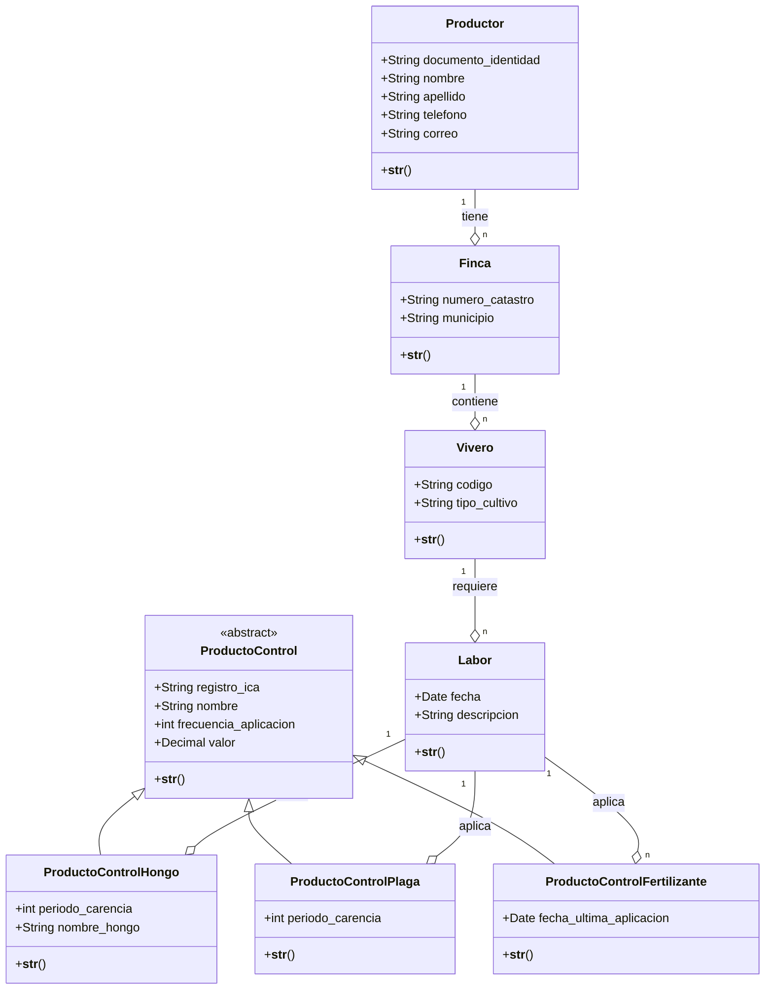
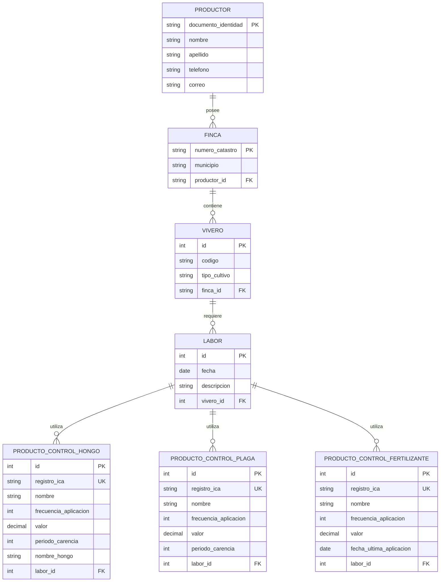

# Sistema de Viveros

Este proyecto implementa un sistema de gestión para productores agrícolas, sus fincas, viveros y labores agrícolas asociadas. Desarrollado con Django, permite llevar un registro detallado de cada elemento y actividad relacionada con el manejo de viveros.

## Descripción

El Sistema de Viveros es una aplicación web diseñada para:

- Gestionar productores y sus datos de contacto
- Registrar fincas con información catastral y geográfica
- Administrar viveros dentro de cada finca con sus tipos de cultivo
- Documentar labores agrícolas realizadas en cada vivero
- Gestionar productos de control (fungicidas, insecticidas y fertilizantes)

## Modelo de Datos

El sistema se estructura en las siguientes entidades:

- **Productor**: Persona identificada por documento, nombre, apellido, teléfono y correo
- **Finca**: Propiedad identificada por número catastral y municipio
- **Vivero**: Área de cultivo identificada por código y tipo de cultivo
- **Labor**: Actividad agrícola realizada con fecha y descripción
- **Productos de Control**: 
  - Control de Hongos: Con período de carencia y nombre del hongo
  - Control de Plagas: Con período de carencia
  - Fertilizantes: Con fecha de última aplicación

### Diagrama de Clases


### Modelo Entidad-Relación



## Tecnologías

- Python 3.8+
- Django 4.2+
- SQLite (desarrollo) / PostgreSQL (producción)
- HTML, CSS, JavaScript (interfaz admin)

## Requisitos

- Python 3.8 o superior
- pip (gestor de paquetes de Python)
- Entorno virtual (recomendado)

## Instalación

1. Clonar el repositorio:
   ```bash
   git clone https://github.com/tu-usuario/sistema-viveros.git
   cd sistema-viveros
   ```

2. Crear y activar un entorno virtual:
   ```bash
   # En Windows
   python -m venv venv
   venv\Scripts\activate
   
   # En macOS/Linux
   python -m venv venv
   source venv/bin/activate
   ```

3. Instalar dependencias:
   ```bash
   pip install -r requirements.txt
   ```

4. Aplicar migraciones:
   ```bash
   python manage.py migrate
   ```

5. Crear un superusuario:
   ```bash
   python manage.py createsuperuser
   ```

6. Iniciar el servidor de desarrollo:
   ```bash
   python manage.py runserver
   ```

7. Acceder al panel de administración:
   - Abrir en el navegador: http://127.0.0.1:8000/admin/
   - Iniciar sesión con el superusuario creado anteriormente

## Estructura del Proyecto

```
sistema_viveros/
├── manage.py
├── sistema_viveros/
│   ├── __init__.py
│   ├── asgi.py
│   ├── settings.py
│   ├── urls.py
│   └── wsgi.py
└── viveros/
    ├── __init__.py
    ├── admin.py
    ├── apps.py
    ├── migrations/
    ├── models.py
    ├── tests.py
    └── views.py
```

## Pruebas

El proyecto incluye pruebas unitarias para verificar el correcto funcionamiento de los modelos y sus relaciones:

```bash
python manage.py test
```

Las pruebas incluyen:
- Validación de campos obligatorios
- Verificación de relaciones entre entidades
- Comprobación de restricciones de unicidad
- Validación de datos (correo, teléfono, etc.)


## Licencia

Este proyecto está licenciado bajo [MIT License](LICENSE).
